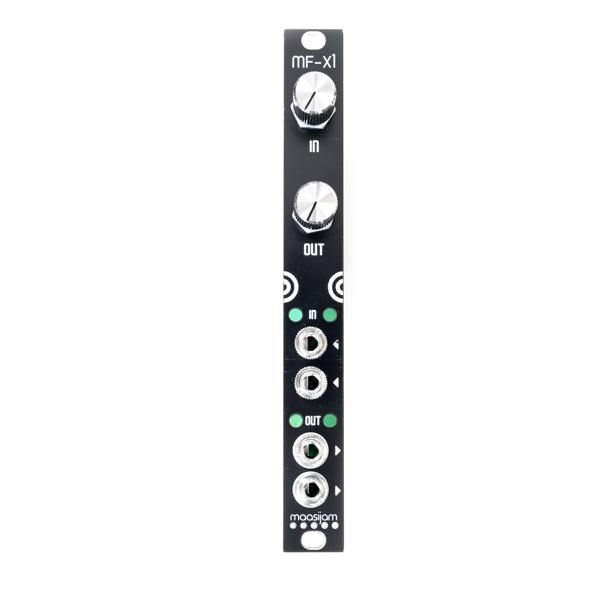
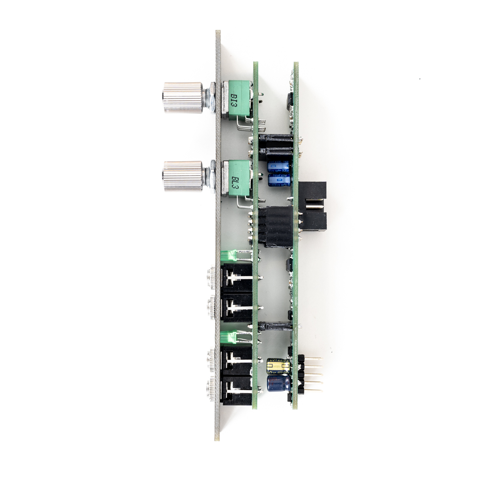
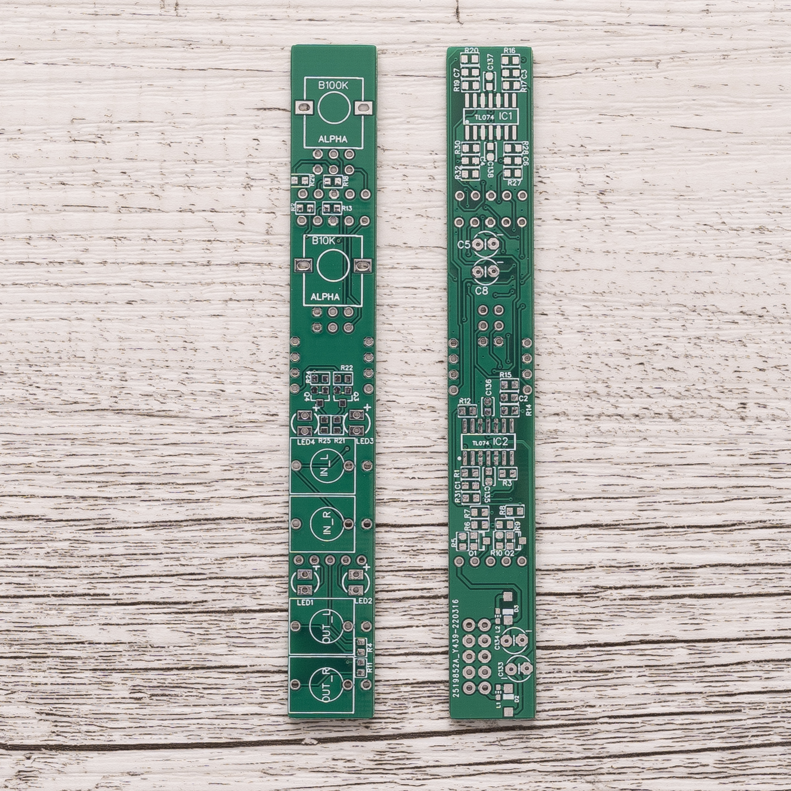

# MF-X1

Expander module for the MONOFA to boost line level to modular level and attenuates modular level to line level (for the MONOFA input). 
The MF-X1 can be connected to the MONOFA on the back.

<h3>Gerbers</h3>

[Gerber files for panel, front and back pcb](Gerber/)

<h3>BOM</h3>

[Bill of materials as CSV](BOM_mf-x1_v1.0revB.csv)
 

<h3>Build guide</h3>

coming soon...
  

