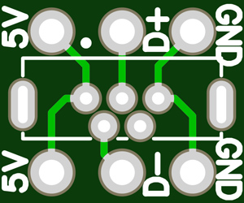

# MF-X2 Gerber Files

 [Gerber_mf-x2_panel](Gerber_mfx2_panel_v1.1_revB.zip) 

---
 [Gerber_mf-x2_front](Gerber_mfx2_front_v1.1_revD.zip) 

---
**Notes:**
The following pcb will also used in the MONOFA module. So, if you want to build both modules, you may only need one order (because of the minimum number of pcbs you often have to order).

 [Gerber_monofa/mf-x2_usb](Gerber_monofa_usb_power_revB_2022-04-25.zip) 
