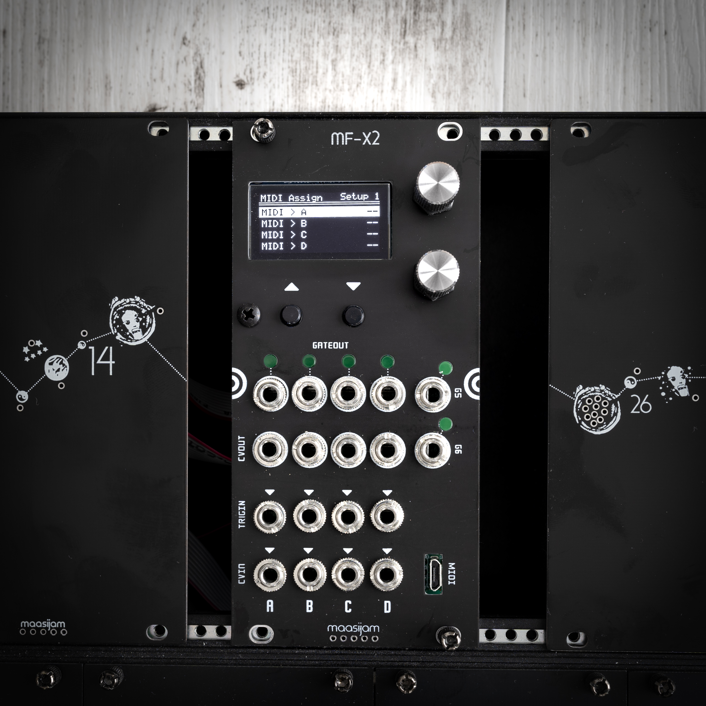
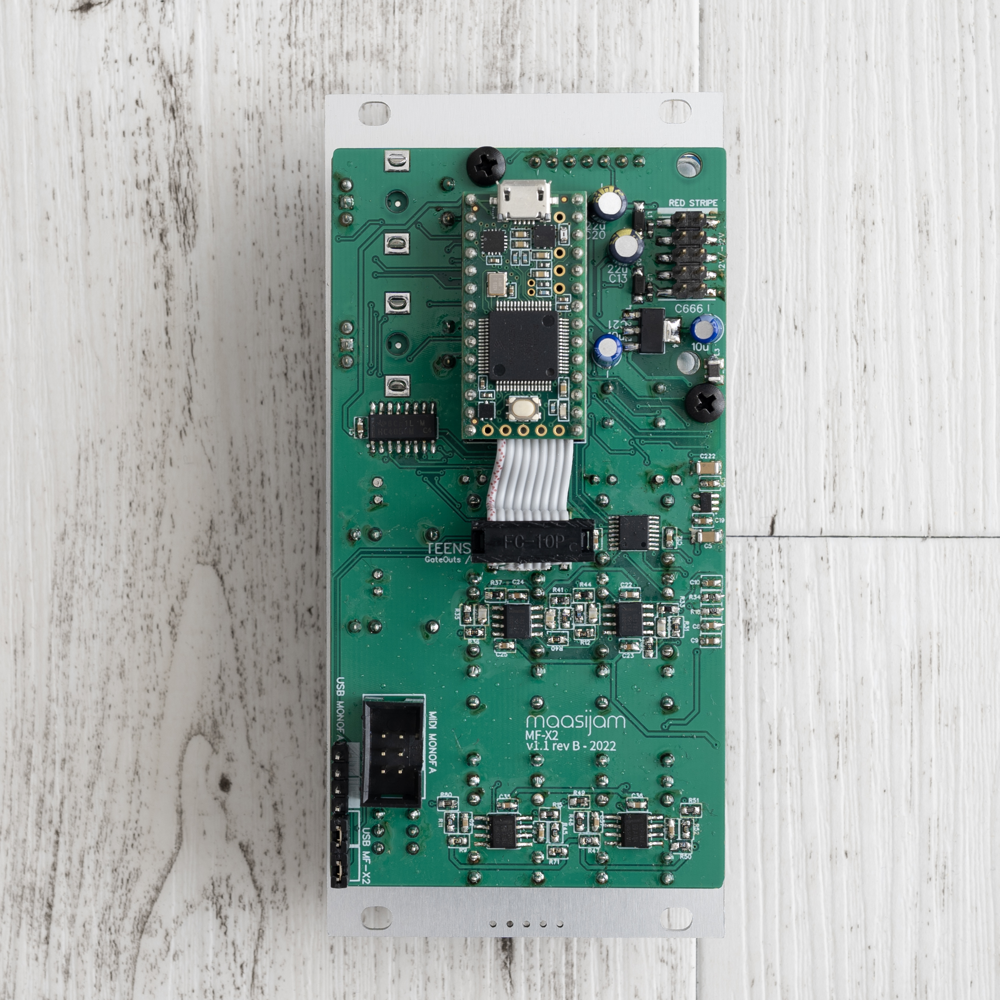
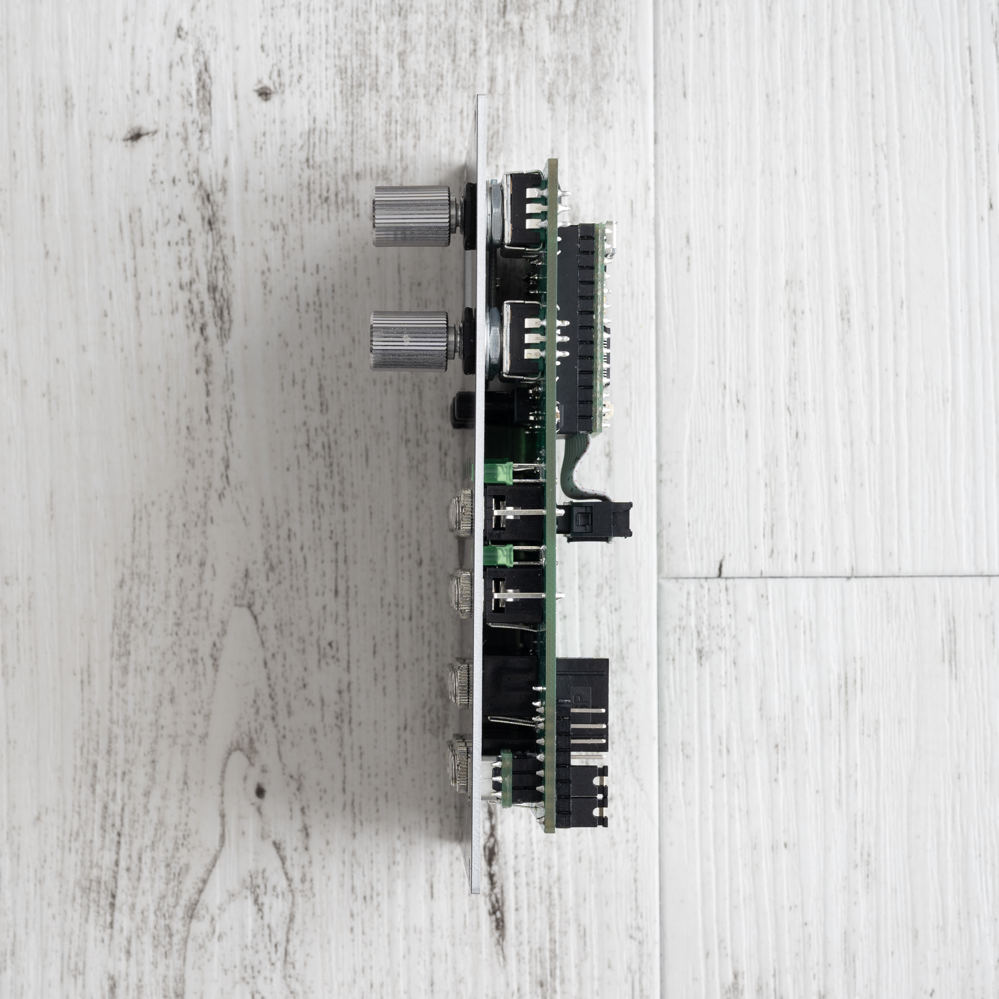

# MF-X2

Expander module for the [MONOFA](../MONOFA/) for MIDI2CV and CV2MIDI. It's an extended [Ornament & Crime](https://github.com/mxmxmx/O_C) (six additional gate outs, micro usb jack on the front panel). The MF-X2 can be connected to the [MONOFA](../MONOFA/) on the back. 

<h3>Gerbers</h3>

[Gerber files for panel, front pcb](Gerbers/)

<h3>BOM</h3>

[Bill of materials as CSV](BOM_mfx2_front_v1.1_revB_2022-04-13.csv)
 

<h3>Build guide</h3>

coming soon...
  

