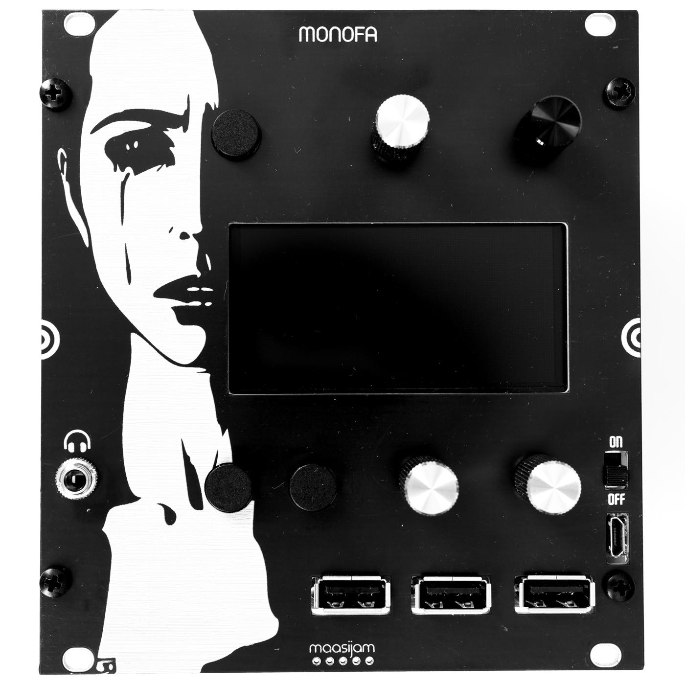
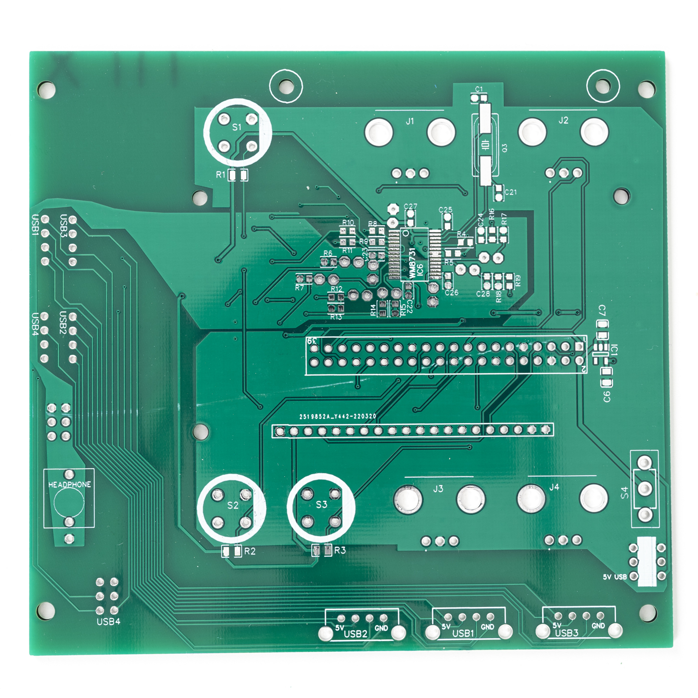
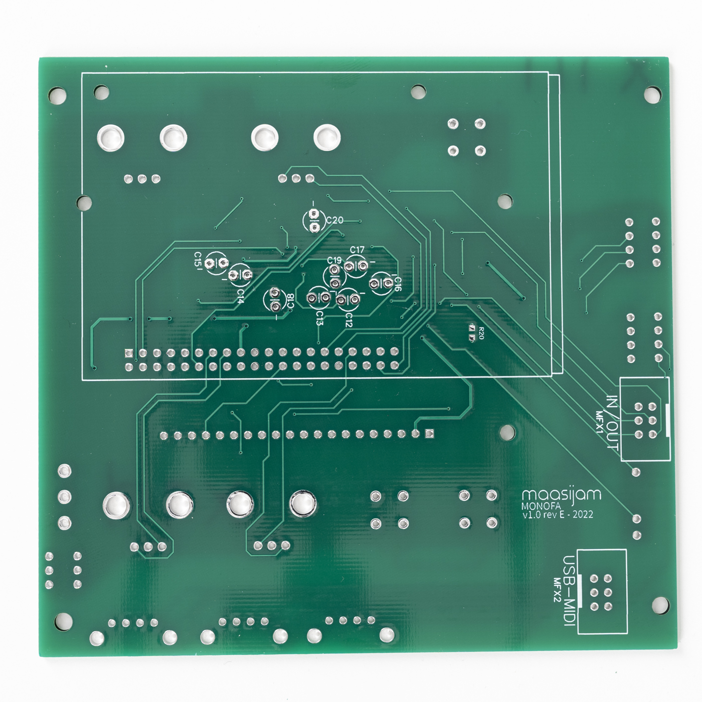
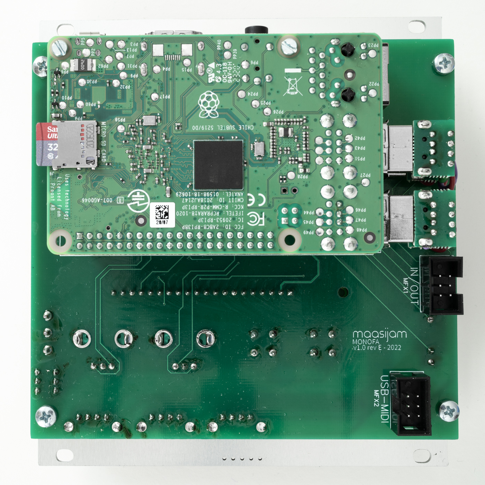
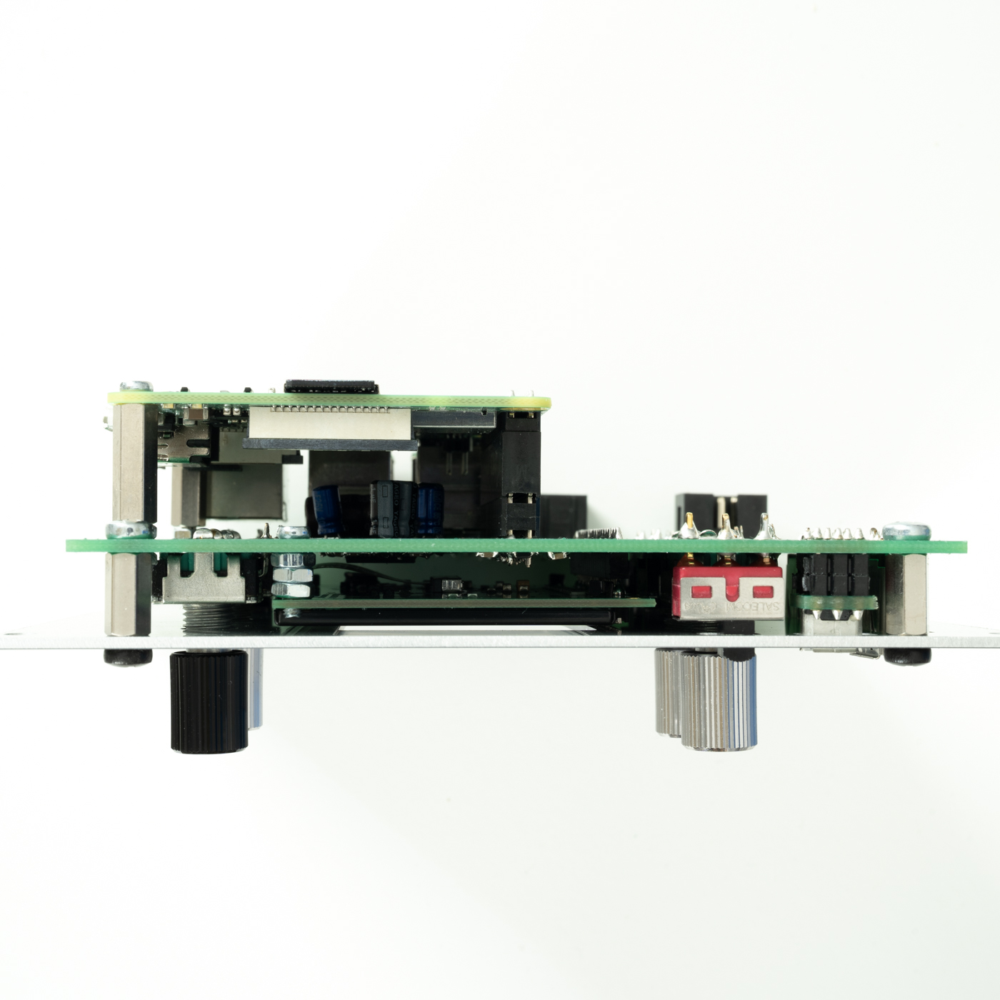
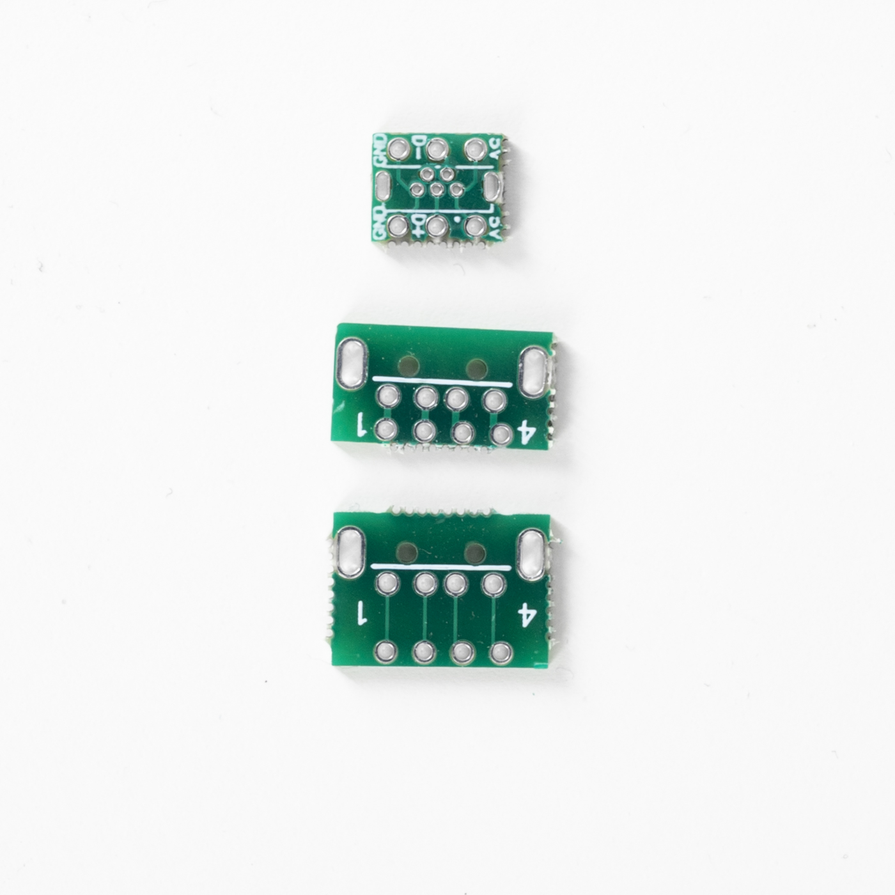

# MONOFA

A norns for eurorack.

<h3>Gerbers</h3>

[Gerber files for panel, main and helper pcbs](Gerber/)
 

<h3>BOM</h3>

[Bill of materials as CSV](BOM_monofa_v1.0_revE.csv)
 

<h3>Build guide</h3>

coming soon...
  

