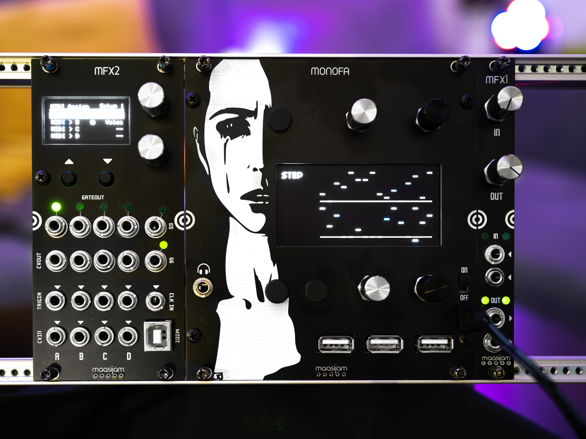
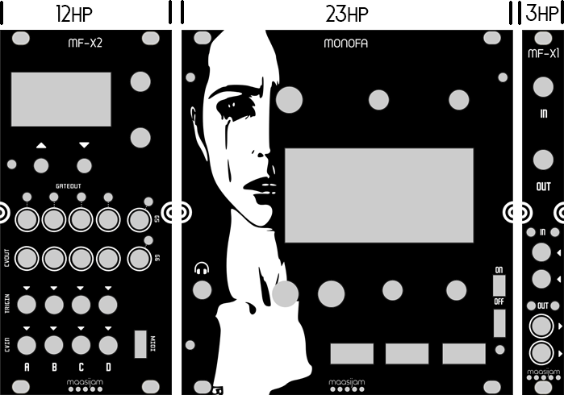

# MONOFA
A Norns for Eurorack

It's based on a ["Fates Norns"](https://github.com/okyeron/fates) combined with an [Ornament & Crime](https://github.com/mxmxmx/O_C) (Captain Midi App) for Midi2CV and CV2Midi. The O_C (MF-X2) has six additional gate outputs. So I don't need to use the 16bit CV Out to generate a simple gate. The [MF-X1](MF-X1/) boosts the norns signal to modular synth signal level and attenuates eurorack level to line level (for the norns input). The two expansion modules can be connected to the MONOFA on the back.

Gerber files, BOMs and build guide coming soon.

