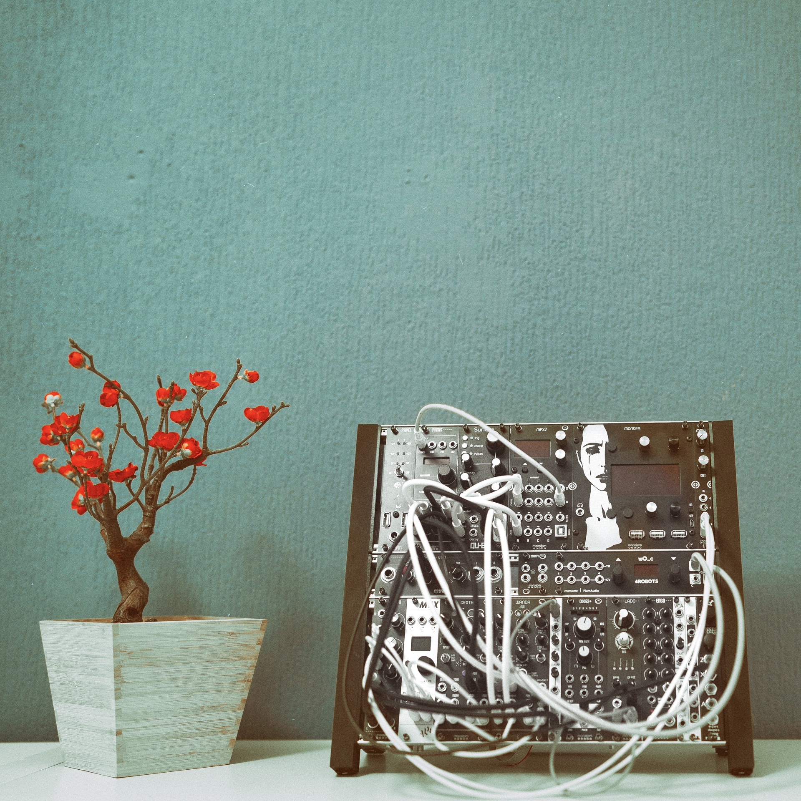

# MONOFA
A Norns for Eurorack

It's based on a ["Fates Norns"](https://github.com/okyeron/fates) combined with an [Ornament & Crime](https://github.com/mxmxmx/O_C) (Captain Midi App) for Midi2CV and CV2Midi. The O_C ([MF-X2](MF-X2/)) has six additional gate outputs and a micro usb jack on the front panel. The [MF-X1](MF-X1/) boosts the norns signal to modular synth signal level and attenuates eurorack level to line level (for the norns input). The two expansion modules can be connected to the MONOFA on the back.

|MONOFA|MF-X1|MF-X2|
|----------|----------|----------|
|[Gerbers, BOM and build guide](MONOFA/)|[Gerbers, BOM and build guide](MF-X1/)|[Gerbers, BOM and build guide](MF-X2/)|

  

